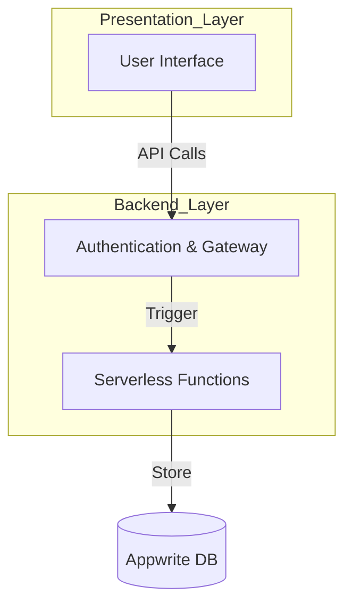

# Architecture Overview

This document provides a visual overview of the system architecture.

## System Architecture Diagram

## Architecture Layers

### Presentation Layer
- **User Interface**: The frontend application that users interact with

### Backend Layer
- **Authentication & Gateway**: Handles authentication and API gateway functions to manage incoming requests
- **Serverless Functions**: Executes business logic in a serverless environment

### Data Layer
- **Appwrite DB**: Database service for storing and retrieving application data

## Data Flow

1. User interactions trigger API calls from the UI to the Authentication & Gateway
2. The Gateway authenticates requests and triggers appropriate Serverless Functions
3. Serverless Functions process business logic and store/retrieve data from the Appwrite DB
4. Responses flow back through the Gateway to the UI
